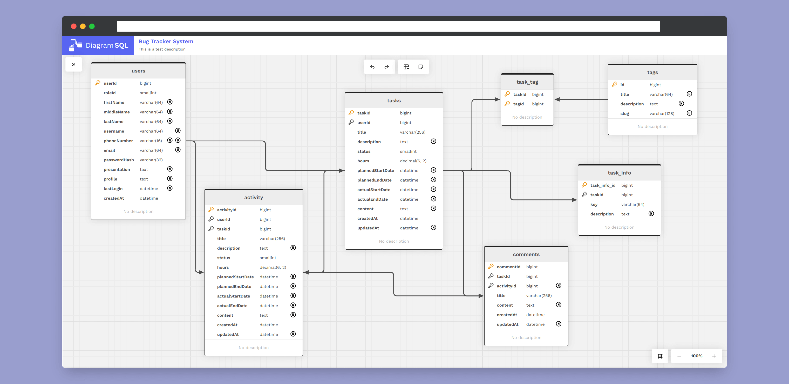

    

 

<figure>
    
</figure>

  <h2>
    An open source database diagram designer.  
    Built with Svelte and IndexedDB.
     
  </h2>

 

  <figure>
    
    <figcaption>
      

        Design beautiful diagrams of your favorite database schema.
      

    </figcaption>
  </figure>

 
<h2>About The Project</h2>
 

Today, there are many web-based tools for designing a database schema; however, I always encountered some inconvenience with each one, preventing me from enjoying their use. In the worst cases, they limited me in the size or complexity of the diagrams I wanted to create. Some of the issues included:

-   **Unattractive design:** Several tools had an old-fashioned or neglected design that didn't attract me enough.
-   **Mandatory use of code for element creation:** Although I enjoy coding, there are many times when I want to create a diagram to test an idea and don't want to spend so much time figuring out how to generate the elements I need.
-   **Limitation on the number of elements in a diagram:** Since many tools are paid, they have limitations in their free version on the number of elements it is possible to create in the diagram.

Because of this, I decided to create DiagramSQL, which is an entity-relationship diagram designer. This way, I could have a tool that addressed the previously mentioned points. The goal of the application is for it to be a long-term project, allowing the addition of new functionalities that suit the needs of developers using this tool.

Currently, DiagramSQL is a complete client-side application. It is built with Svelte and uses IndexedDB as a database directly in the browser.
