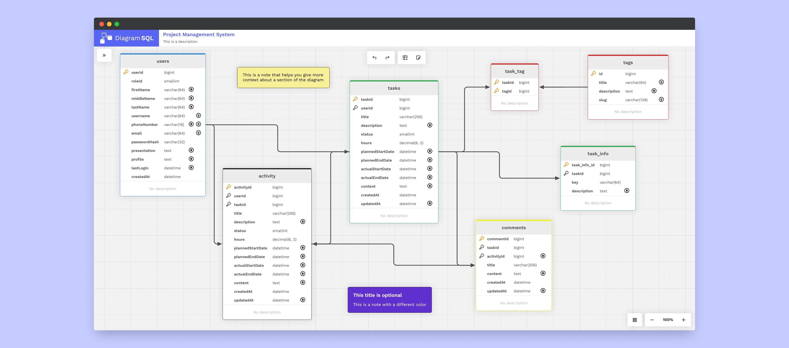

<figure>
    
</figure>

  <h2>
    An open source database diagram designer tool.
      
  </h2>

---

 

    

  <figure>
    
    <figcaption>
      

        Design beautiful diagrams of your favorite database schema.
      

    </figcaption>
  </figure>

